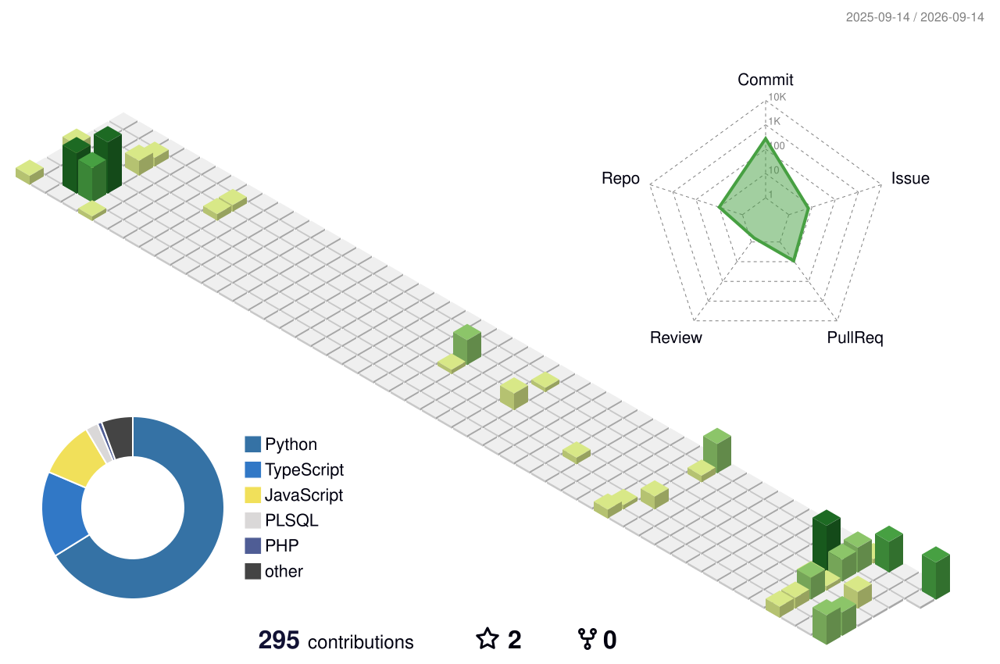

  <!-- Header Dinâmico com Ondas -->
  

  <!-- Terminal Hacker Typing (Animado em Loop) -->
  

 

<!-- Cartão de Visita Digital (ID Card) -->

| 💼 **Perfil Profissional** | **Detalhes & Especialidades** |
| :--- | :--- |
| 🏷️ **Cargo / Foco** | **Engenheiro de Software & Arquiteto de Soluções** |
| 📍 **Localização** | Rio Grande do Sul, Brasil |
| ⚡ **Especialidades** | Arquitetura Web, Sistemas de Missão Crítica, Geoprocessamento (GIS) & Inteligência de Dados |
| 🛠️ **Core Stack** | `Laravel` `Python` `TypeScript` `PostgreSQL / PostGIS` `Docker` `Linux` |
| 🌐 **Conexões** |   |

 

---

### 🏆 Conquistas de Código & Gamificação

  

---

### 🏙️ Relevo 3D de Contribuições (Skyscrapers Animados)
> *As colunas erguem-se do chão em 3D proporcionalmente ao volume de código entregue.*

  

<!-- Telemetria contínua de commits -->

  

---

### ⚡ Ritmo, Streak & Métricas

  
  

---

### 🛠️ Tecnologias & Arsenal Técnico

  

  

 

  Construído com automação contínua • jonasCTDOL

