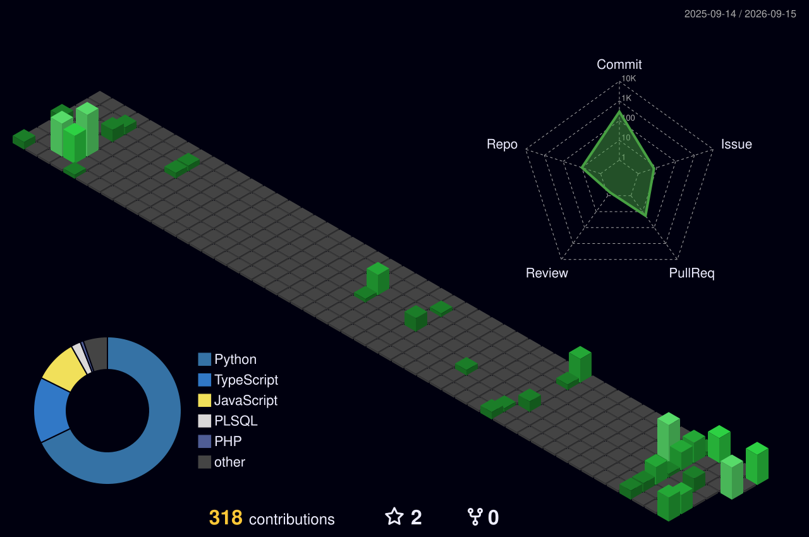

  <!-- Header Ondas -->
  

  <!-- Terminal Hacker Typing Animado -->
  

 

<!-- Cartão de Visita Digital -->

| 💼 **Perfil Profissional** | **Detalhes & Especialidades** |
| :--- | :--- |
| 🏷️ **Foco de Atuação** | **Engenheiro de Software & Arquiteto de Soluções** |
| 📍 **Localização** | Rio Grande do Sul, Brasil |
| ⚡ **Especialidades** | Arquitetura Web, Missão Crítica, Geoprocessamento (GIS) & Data Intelligence |
| 🛠️ **Core Stack** | `Laravel` `Python` `TypeScript` `PostgreSQL / PostGIS` `Docker` `Linux` |
| 🌐 **Conexões** |   |

 

---

### 🏙️ Relevo 3D de Contribuições (Skyscrapers)
> *Muralha de contribuições tridimensional gerada a partir do histórico de commits.*

  

---

### ⚡ Ritmo, Streak & Consistência

  

  

---

### 🛠️ Arsenal Tecnológico

  

 

  Construído com automação contínua • jonasCTDOL

